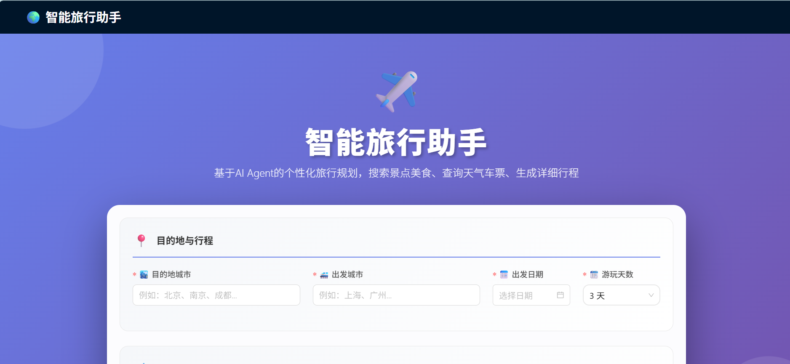
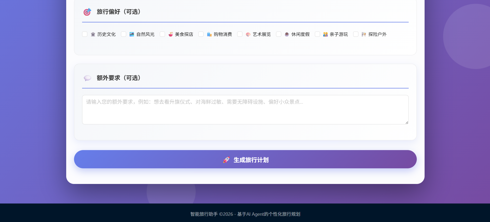
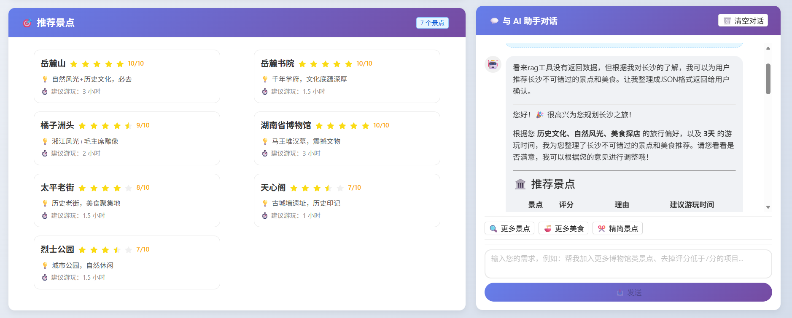
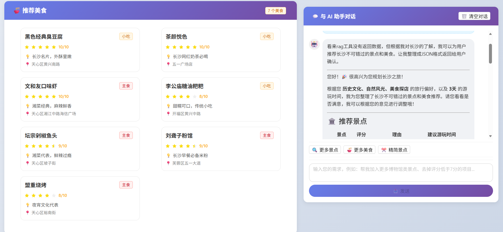
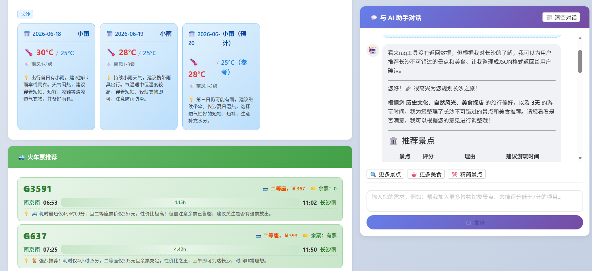
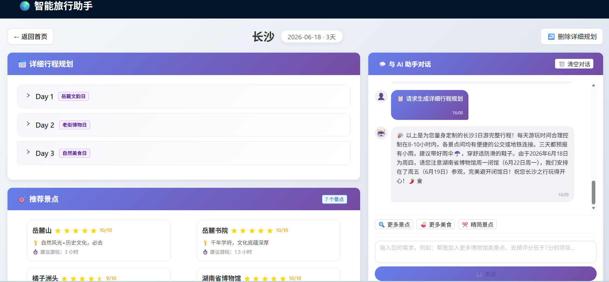
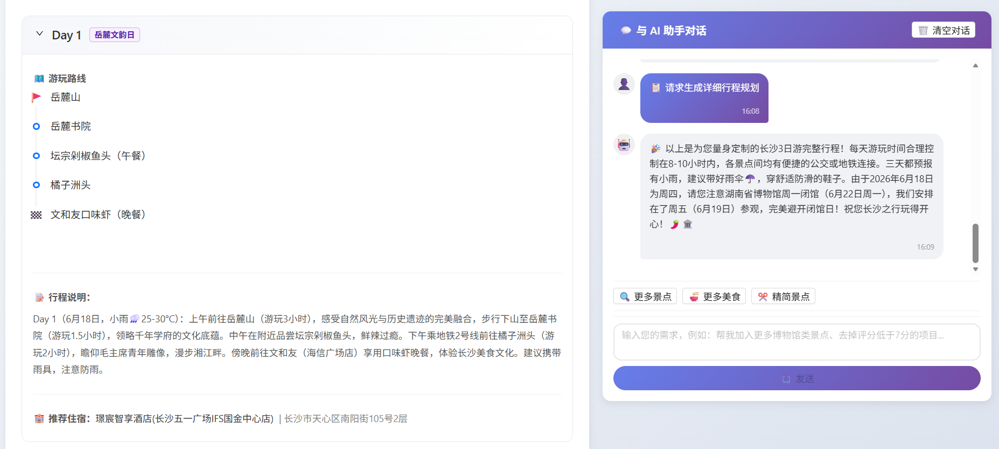

# 🌍 智能旅行助手 (Travel Agent)

基于 **LangChain + LangGraph 多智能体框架**的智能旅行规划助手，集成 **MCP（Model Context Protocol）**、**RAG（检索增强生成）**、**SKILL 技能系统**与**记忆管理**，为用户提供一站式的旅行规划服务——从景点美食搜索、天气查询、火车票查询到每日详细行程规划。

---

## 📑 目录

- [1. 项目部署和运行](#1-项目部署和运行)
  - [1.1 环境要求](#11-环境要求)
  - [1.2 后端部署](#12-后端部署)
  - [1.3 前端部署](#13-前端部署)
  - [1.4 构建 RAG 向量数据库](#14-构建-rag-向量数据库)
- [2. 功能介绍与用户操作](#2-功能介绍与用户操作)
  - [2.1 首页 —— 填写旅行信息](#21-首页--填写旅行信息)
  - [2.2 结果页 —— 查看规划结果](#22-结果页--查看规划结果)
  - [2.3 对话交互 —— 修改与调整](#23-对话交互--修改与调整)
- [3. Agent 多智能体框架](#3-agent-多智能体框架)
  - [3.1 整体架构](#31-整体架构)
  - [3.2 RouteAgent（主编排智能体）](#32-routeagent主编排智能体)
  - [3.3 Search Agent（搜索智能体）](#33-search-agent搜索智能体)
  - [3.4 Plan Agent（行程规划智能体）](#34-plan-agent行程规划智能体)
  - [3.5 TravelPlanAgent（火车票查询智能体）](#35-travelplanagent火车票查询智能体)
  - [3.6 WeatherAgent（天气查询智能体）](#36-weatheragent天气查询智能体)
- [4. 主要技术介绍](#4-主要技术介绍)
  - [4.1 记忆管理（Memory）](#41-记忆管理memory)
  - [4.2 检索增强生成（RAG）](#42-检索增强生成rag)
  - [4.3 SKILL 技能系统](#43-skill-技能系统)
  - [4.4 MCP（Model Context Protocol）](#44-mcpmodel-context-protocol)
  - [4.5 中间件与状态机](#45-中间件与状态机)
- [5. 项目结构](#5-项目结构)
- [6. API 接口文档](#6-api-接口文档)
- [7. 技术栈](#7-技术栈)

---

## 1. 项目部署和运行

### 1.1 环境要求

| 依赖 | 版本要求 | 说明 |
|------|---------|------|
| Python | 3.11（推荐使用 Conda） | 后端运行环境 |
| Conda | 最新版 | 用于创建和管理 Python 虚拟环境 |
| Node.js | ≥ 18 | 前端构建，以及 npx 启动 12306 MCP 服务 |
| npm / npx | ≥ 9 | Node 包管理器 |
| uv / uvx | 最新版 | Python 包管理器，用于启动高德地图 MCP 服务 |

> **💡 推荐环境**：本项目在 `travel_agent` Conda 环境（Python 3.11.15）下开发和测试。建议使用 Conda 创建独立环境以避免依赖冲突。

### 1.2 后端部署

#### 1.2.1 创建 Conda 环境并安装依赖

**方式一：使用 Conda 创建新环境（推荐）**

```bash
# 创建 Python 3.11 的 Conda 环境
conda create -n travel_agent python=3.11 -y

# 激活环境
conda activate travel_agent
```

**方式二：使用 venv 创建虚拟环境**

```bash
cd Travel_Agent/backend
python -m venv venv
source venv/bin/activate  # Linux/Mac
# 或 venv\Scripts\activate  # Windows
```

**安装 Python 依赖**

项目根目录提供了完整的 `requirements.txt`，可直接安装：

```bash
# 使用 pip 一键安装所有依赖
pip install -r requirements.txt
```

`requirements.txt` 包含所有核心依赖（[查看完整列表](requirements.txt)）：

| 核心包 | 版本 | 用途 |
|--------|------|------|
| `langchain` | 1.3.2 | LLM 应用框架 |
| `langgraph` | 1.2.2 | 有状态多步骤 Agent 编排 |
| `langchain-mcp-adapters` | 0.2.2 | MCP 协议适配器 |
| `langchain-openai` | 1.2.2 | OpenAI 兼容 LLM 接口 |
| `langchain-classic` | 1.0.7 | 经典 LangChain 组件（记忆管理等） |
| `langchain-chroma` | 1.1.0 | ChromaDB 向量存储集成 |
| `fastapi` | 0.136.1 | Web 框架 |
| `uvicorn` | 0.47.0 | ASGI 服务器 |
| `chromadb` | 1.5.9 | 向量数据库 |
| `sentence-transformers` | 5.5.1 | 文本嵌入模型 |
| `modelscope` | 1.37.1 | 模型下载源 |
| `mcp` | 1.27.1 | MCP 协议核心库 |
| `torch` | 2.12.0 | 深度学习框架（嵌入模型推理） |
| `transformers` | 4.57.6 | HuggingFace 模型库 |
| `pydantic` | 2.13.4 | 数据校验 |
| `pydantic-settings` | 2.14.1 | 配置管理 |
| `python-dotenv` | 1.2.2 | 环境变量加载 |

> **⚠️ 注意**：如果使用 Conda 环境，请确保已激活正确的环境（`conda activate travel_agent`）后再执行 `pip install`。

#### 1.2.2 配置环境变量

编辑 `backend/.env` 文件，配置以下关键参数：

```env
# LLM 配置（使用 DeepSeek 作为示例，也支持任何 OpenAI 兼容接口）
MODEL_NAME=deepseek-chat
API_KEY=your_api_key_here
BASE_URL=https://api.deepseek.com/v1
LLM_TIMEOUT=60

# 服务器配置
HOST=0.0.0.0
PORT=8000
CORS_ORIGINS=http://localhost:7007,http://localhost:3000

# 高德地图 API Key（必填，用于天气查询、地图搜索、路线规划）
AMAP_API_KEY=your_amap_api_key_here

# 日志级别
LOG_LEVEL=INFO
```

> **⚠️ 必填项说明**：
> - `API_KEY`：LLM 服务商的 API Key（DeepSeek 或 OpenAI 等）
> - `AMAP_API_KEY`：高德地图 API Key，前往 [高德开放平台](https://lbs.amap.com/) 申请，用于天气查询、POI 搜索、路线规划等

#### 1.2.3 确保 MCP 运行时可用

后端依赖 `npx` 和 `uvx` 来启动 MCP 服务，请确保它们在 PATH 中：

```bash
# 验证 npx（Node.js 自带）
which npx
# 预期输出: /path/to/nvm/versions/node/vXX.XX.X/bin/npx

# 验证 uvx（通常与 uv 一起安装）
which uvx
# 如果未安装，执行: pip install uv
# 或: curl -LsSf https://astral.sh/uv/install.sh | sh
```

> **💡 提示**：如果使用 Conda 环境，`uvx` 会被安装在 Conda 环境的 `bin/` 目录下。激活环境后自动在 PATH 中。

#### 1.2.4 启动后端服务

```bash
# 如使用 Conda 环境，先激活
conda activate travel_agent

python backend/run.py
```

启动成功后，终端将显示：

```
12306 MCP Server running on stdio @Joooook
Installed 24 packages in 26ms
找到8个工具
Processing request of type ListToolsRequest
找到16个工具
plan agent工具数： 17
初始化中间件
INFO:     Application startup complete.
```

> **📌 说明**：
> - 启动入口文件为 [backend/run.py](backend/run.py)，内部调用 `uvicorn` 启动 [app.api.main:app](backend/app/api/main.py)，开启了热加载（`reload=True`），修改代码后自动重启
> - 后端启动时会自动初始化 MCP 客户端（连接 12306 和高德地图服务），这个过程可能需要几秒钟

### 1.3 前端部署

#### 1.3.1 安装依赖

```bash
cd Travel_Agent/frontend
npm install
```

#### 1.3.2 启动开发服务器

```bash
npm run dev
```

前端开发服务器默认运行在 `http://localhost:7007`，并自动将 `/chat` 请求代理到后端 `http://127.0.0.1:8000`。


### 1.4 构建 RAG 向量数据库

在启动后端之前，需要构建用于小众景点检索的向量数据库：

```bash
cd Travel_Agent/backend
python vector_db_build.py
```

该脚本会：
1. 从 ModelScope 下载嵌入模型 `bge-base-zh-v1.5`
2. 读取 `docs/rag` 目录下的 JSON 数据文件（如 `Changsha.json`）
3. 将景点描述向量化后存入 ChromaDB（持久化存储于 `chroma_db/` 目录）

> 如需添加更多城市的小众景点数据，在 `docs/` 目录下新建对应的 JSON 文件并重新运行构建脚本即可。

---

## 2. 功能介绍与用户操作

智能旅行助手提供完整的旅行规划流程，用户只需在首页填写基本信息，系统即可自动完成景点搜索、美食推荐、天气查询、火车票查询和每日行程规划。

### 2.1 首页 —— 填写旅行信息

用浏览器访问`http://localhost:7007`，用户看到首页表单，按以下步骤操作：

 <!-- 请替换为实际截图 -->
 <!-- 请替换为实际截图 -->

**第一步：目的地与行程**

| 字段 | 说明 | 示例 |
|------|------|------|
| 目的地城市 | 计划前往的城市 | 长沙 |
| 出发城市 | 从哪个城市出发 | 南京 |
| 出发日期 | 计划出发的日期（不可选过去日期） | 2026-06-18 |
| 游玩天数 | 1~15 天可选 | 3 |

**第二步：旅行偏好（可选）**

用户可选择多个旅行风格标签，帮助系统更精准地推荐：
- 🏛️ 历史文化
- 🌿 自然风光
- 🍜 美食探店
- 🛍️ 购物消费
- 🎨 艺术展览
- 🏖️ 休闲度假
- 👨‍👩‍👧 亲子游玩
- 🧗 探险户外

**第三步：额外要求（可选）**

用户可在文本框中输入额外的定制化需求，例如"希望多安排一些适合拍照的小众景点"、"预算有限，推荐性价比高的美食"等。若用户提及“小众景点”等类似字眼，系统会自动开启检索增强生成。

**第四步：点击底部"生成旅行计划"**

点击按钮后，系统将自动执行以下流程：
1. 调用天气 Agent 查询目的地天气
2. 调用火车票 Agent 查询列车信息
3. 调用主 Agent（search 步骤）搜索景点和美食
4. 返回完整的景点美食列表、天气和车票信息

### 2.2 结果页 —— 查看规划结果

结果页采用**双栏布局**，左侧展示结构化数据，右侧为对话面板。

 <!-- 请替换为实际截图 -->

 <!-- 请替换为实际截图 -->

 <!-- 请替换为实际截图 -->

**左栏内容区域：**

- **景点卡片网格**：每个景点卡片展示名称、评分、推荐理由和游玩时长
- **美食卡片网格**：展示美食名称、评分、类型（主食/小吃）、推荐理由和地址
- **天气信息卡片**：逐日展示天气状况、温度范围、风力及出行穿衣建议
- **火车票信息卡片**：展示推荐列车班次、时间、票价和余票信息

**右栏对话面板：**

- 支持与 Agent 自由对话，修改景点/美食/行程
- 快捷操作按钮：更多景点、更多美食、精简景点
- 支持 Markdown 渲染的富文本消息展示
- 可清空对话历史重新开始

### 2.3 生成详细行程规划

用户确认感兴趣的景点和美食后，在右侧对话框输入"帮我规划一下这几天的行程"或点击右上角**生成详细规划**按钮，系统将切换到 plan Agent，按天规划行程。规划结果将显示在左侧顶部。

 <!-- 请替换为实际截图 -->

 <!-- 请替换为实际截图 -->

### 2.3 对话交互 —— 修改与调整

用户可以通过自然语言与 Agent 交互，实现以下操作：

| 用户意图 | 示例对话 | 系统行为 |
|---------|---------|---------|
| 搜索景点美食 | "帮我推荐长沙的必去景点" | 切换到 search Agent，搜索并返回景点美食列表 |
| 增加/减少景点 | "再加上一些室内景点" | 在现有列表中增加景点 |
| 增加/删除美食 | "不要剁椒鱼头" | 从列表中移除指定美食 |
| 重新生成行程规划 | "帮我重新规划一下这几天的行程，要求..." | 切换到 plan Agent，按天规划行程 |
| 闲聊问答 | "橘子洲头有什么特色" | 切换到 chat Agent，回答旅行相关问题 |

> **💡 提示**：所有修改操作都会返回**完整的**更新后列表，确保数据一致性。
---

## 3. Agent 多智能体框架

本项目的核心是**基于 LangGraph 的多智能体协作框架**，以 `RouteAgent` 为主编排器，协调多个专业子智能体完成旅行规划任务。

### 3.1 整体架构

```
                        ┌──────────────────────────┐
                        │     用户请求 (POST /chat) │
                        └────────────┬─────────────┘
                                     │
                    ┌────────────────┼────────────────┐
                    │                                 │
                    ▼                                 ▼
            ┌──────────────┐                  ┌──────────────┐
            │WeatherAgent  │                  │TravelPlanAgent│
            │  天气查询     │                  │   火车票查询  │
            └──────┬───────┘                  └──────┬───────┘
                   │                                 │
                   │                                 │
                   │      缓存至 InMemoryStore        │
                   └────────────────┼────────────────┘
                                    │
                                    ▼
                    ┌───────────────────────────────┐
                    │       RouteAgent 状态机        │
                    │  chat ◄─► search ◄─► plan     │
                    │    (中间件驱动的步骤切换)       │
                    └──────────────┬────────────────┘
                                   │
                                   ▼
                    ┌───────────────────────────────┐
                    │         返回 AgentResponse    │
                    │  (ai_message + weather +      │
                    │   travel_mode)                │
                    └───────────────────────────────┘
```


### 3.2 RouteAgent（主编排智能体）

**RouteAgent** 是整个系统的核心，负责接收用户请求并在不同的子步骤之间进行智能切换。

- **类**：`RouteAgent`（定义于 [agents.py](backend/app/api/agents/agents.py#L14)）
- **LLM**：通过 `ChatOpenAI` 调用（默认 DeepSeek Chat，支持任意 OpenAI 兼容接口）
- **状态管理**：通过`transfer_status`工具自适应切换状态，通过 `SupportState` 状态模式跟踪当前步骤。
- **中间件**：`ApplyStepConfig` —— 缠绕式中间件，在每次模型调用时根据当前步骤注入对应的系统提示词和工具集

**三种步骤状态：**

| 步骤 | 状态值 | 系统提示词 | 可用工具 | 功能说明 |
|------|--------|-----------|---------|---------|
| 聊天 | `chat` | `ROUTE_AGENT` | 高德地图工具 + get_weather + load_skill + rag | 闲聊问答，识别用户意图并交接 |
| 搜索 | `search` | `SEARCH_AGENT` | get_weather + rag | 搜索景点和美食，支持小众景点 RAG 检索 |
| 规划 | `plan` | `TRIP_PLAN_AGENT` | 高德地图全量工具 + get_weather | 规划每日行程、推荐酒店、计算路线 |

**步骤切换机制**：通过 `transfer_status` 工具实现。该工具接收目标步骤（`chat`/`search`/`plan`），通过 LangGraph 的 `Command(update={...})` 机制更新 `current_step` 状态，中间件在下一次模型调用时自动生效。

### 3.3 Search Agent（搜索智能体）

- **提示词**：`SEARCH_AGENT`
- **核心技能**：`spot_food_search`
- **工作流程**：
  1. 根据城市和游玩天数搜索必去景点和必尝美食
  2. 调用 `get_weather` 查询天气，若雨天较多则建议增加室内景点
  3. 对每个景点/美食按 1-10 分评分（仅返回 6 分以上项目）
  4. 以严格 JSON 格式返回结果
  5. 支持用户对列表进行增删改操作

### 3.4 Plan Agent（行程规划智能体）

- **提示词**：`TRIP_PLAN_AGENT`
- **核心技能**：`plan`
- **工作流程**：
  1. 使用高德地图工具获取各景点经纬度和距离信息
  2. 将距离近的景点划分到同一天。若某一景点离市区较远，单独分配一天。
  3. 为每天分配午餐和晚餐（从美食列表中选取）
  4. 推荐酒店（若用户没有特殊要求，优先快捷酒店，靠近市区或景点群）
  5. 查询交通路线，确保每日总时间不超过 12 小时
  6. 输出包含主题、路线、酒店、描述的完整日计划 JSON

### 3.5 TravelPlanAgent（火车票查询智能体）

- **类**：`TravelPlanAgent`（定义于 [agents.py](backend/app/api/agents/agents.py#L37)）
- **工具**：12306 MCP 工具（通过 `npx -y 12306-mcp` 加载）
- **功能**：根据出发城市、目的城市和出发日期查询火车/高铁票
- **输出**：从价格、余票、行程时间等角度筛选最优的三趟列车，以 JSON 格式返回

### 3.6 WeatherAgent（天气查询智能体）

- **类**：`WeatherAgent`（定义于 [agents.py](backend/app/api/agents/agents.py#L61)）
- **工具**：`maps_weather`（来自高德 MCP）+ `load_skill`
- **技能**：`weather_query`
- **功能**：查询目的地未来几天的天气，给出出行和穿衣建议
- **输出**：包含日期、天气状况、温度、风力、建议的结构化 JSON

---

## 4. 主要技术介绍

### 4.1 记忆管理（Memory）

系统实现了**双层记忆机制**，兼顾短期对话上下文与长会话摘要。

#### 4.1.1 ConversationSummaryBufferMemory（对话摘要缓冲记忆）

定义于 [memory.py](backend/app/api/memory/memory.py)。

```
┌─────────────────────────────────────────┐
│        ConversationSummaryBufferMemory   │
│                                          │
│   ┌──────────┐      ┌──────────────────┐ │
│   │ 近期消息  │ ───► │  摘要（旧消息）    │ │
│   │ (详细保留)│      │  (LLM 压缩总结)   │ │
│   └──────────┘      └──────────────────┘ │
│                                          │
│   令牌上限: 2000 tokens                   │
│   当消息超过上限时，自动将旧消息压缩为摘要   │
└─────────────────────────────────────────┘
```

- 基于 LangChain 的 `ConversationSummaryBufferMemory`
- 令牌上限设为 **2000 tokens**，平衡上下文完整性与 LLM 调用成本
- 当对话历史超出上限时，自动使用 LLM 将较早的消息压缩为摘要
- Memory 实例绑定到每个 Session，不同用户/会话之间完全隔离

#### 4.1.2 Session 管理

定义于 [session.py](backend/app/api/memory/session.py)。

| 组件 | 说明 |
|------|------|
| `Session` | 封装一个 `Memory` 实例 + `total_tokens` 计数 + `last_activate_time` 时间戳 |
| `SessionManager` | 维护 `dict[str, Session]` 表，管理所有活跃会话 |
| 清理线程 | 守护线程定期清理超时未活动的会话（默认 30 秒过期，每 6 秒检查一次） |

**API 方法：**
- `query(session_id)`：获取会话历史消息
- `update_history(session_id, message, role)`：添加用户/AI 消息
- `empty(session_id)`：清空会话历史

#### 4.1.3 InMemoryStore（内存存储）

使用 LangGraph 的 `InMemoryStore` 缓存天气和火车票查询结果：

- 存储键：`(user_id, session_id)` → 值名称（如 `request_state`、`plan`）
- 当检测到用户的请求参数（城市、日期、天数）未变化时，直接复用缓存的天气和车票数据
- 避免重复调用外部 MCP 服务，显著提升响应速度

### 4.2 检索增强生成（RAG）

系统利用 **ChromaDB 向量数据库 + BGE 嵌入模型**实现小众景点的语义检索。

#### 4.2.1 架构流程

```
┌──────────────┐     ┌─────────────────┐     ┌──────────────┐
│  docs/*.json │────►│ vector_db_build │────►│  chroma_db/  │
│  景点数据     │     │   .py 构建脚本   │     │  向量存储     │
└──────────────┘     └─────────────────┘     └──────┬───────┘
                                                    │
                     ┌──────────────────────────────┘
                     │
                     ▼
┌──────────────────────────────────────────────────────────┐
│                    RAG 查询流程                           │
│                                                          │
│  用户查询 ──► BGE 模型编码 ──► ChromaDB 向量检索          │
│              "适合拍照的       (top-5, 按城市过滤)         │
│               小众景点"            │                      │
│                                   ▼                      │
│              返回结果 ◄── metadatas (name, address, desc) │
└──────────────────────────────────────────────────────────┘
```

#### 4.2.2 核心组件

| 组件 | 技术选型 | 说明 |
|------|---------|------|
| 嵌入模型 | `BAAI/bge-base-zh-v1.5` | 从 ModelScope 下载，中文语义理解优秀 |
| 向量数据库 | ChromaDB (PersistentClient) | 持久化存储于 `chroma_db/` 目录 |
| 集合名称 | `minority_spot` | 存储小众景点向量及元数据 |
| 检索参数 | top-5, 按城市过滤 | 每次返回最相关的 5 个结果 |

#### 4.2.3 知识库数据格式

`docs/Changsha.json` 示例：

```json
{
  "city": "长沙",
  "spot": [
    {
      "name": "橘子洲头",
      "address": "长沙市岳麓区橘子洲",
      "description": "橘子洲是湘江中最大的名洲，四面环水，绵延数十里，是长沙的标志性景点..."
    }
  ]
}
```

#### 4.2.4 将RAG封装为LangChain工具

`rag` 被封装为 LangChain `@tool`（定义于 [rag.py](backend/app/api/rag/rag.py#L12)），可直接被 Agent 调用：

```python
@tool
def rag(query: str, city: str):
    """用于查询小众景点"""
```

Agent 在需要时自动调用此工具，无需用户显式指定。当用户在偏好中表达对小众景点的兴趣时，search Agent 会在 `spot_food_search` 技能引导下自动触发 RAG 检索。

### 4.3 SKILL 技能系统

SKILL 系统为 Agent 提供**结构化的分步操作指南**，使得 Agent 面对复杂任务时能够按照预定义的流程执行。

#### 4.3.1 技能定义格式

每个技能是一个 `SKILL.md` 文件，由**元数据头**和**步骤正文**组成：

```markdown
name: spot_food_search
description: 根据用户输入的目的地，查询该目的地用户可能感兴趣的景点和美食
---
# Step1
搜索用户可能感兴趣的景点与美食...

# Step2
调用get_weather查询目的地天气情况...

# Step3
输出。格式必须为合法JSON...
```

元数据字段：
| 字段 | 说明 |
|------|------|
| `name` | 技能唯一标识（英文 ID），Agent 通过该名称调用 |
| `description` | 1-2 句话简介，注入到系统提示词中供 Agent 决策 |

#### 4.3.2 技能列表

| 所属 Agent | 技能名称 | 文件位置 | 功能描述 |
|-----------|---------|---------|---------|
| chat | `trip_plan` | [.skills/chat/trip_plan/](backend/.skills/chat/trip_plan/SKILL.md) | 编排整体流程：搜索景点美食 → 用户确认 → 行程规划 |
| search | `spot_food_search` | [.skills/search/spot_food_search/](backend/.skills/search/spot_food_search/SKILL.md) | 搜索景点美食、调用天气工具、支持 RAG 小众景点、支持修改列表 |
| plan | `plan` | [.skills/plan/plan/](backend/.skills/plan/plan/SKILL.md) | 按天规划行程、使用地图工具计算距离、分配餐饮、推荐酒店 |
| weather | `weather_query` | [.skills/weather/weather_query/](backend/.skills/weather/weather_query/SKILL.md) | 调用 maps_weather 查询天气并返回结构化 JSON |

#### 4.3.3 技能加载机制

```
┌──────────────────────────────────────────────────────────┐
│                    技能加载流水线                         │
│                                                          │
│  1. 启动时                                                │
│     load_skills_from_skill_dir() 扫描 .skills/ 目录       │
│     ├── 解析每个 SKILL.md 的元数据和正文                   │
│     └── 按 agent 角色分类存入 SKILLS 字典                  │
│                                                          │
│  2. 每次模型调用前（中间件）                               │
│     ApplyStepConfig.awrap_model_call()                   │
│     ├── 根据 current_step 获取该步骤可用的技能列表          │
│     └── 将技能名称和描述注入系统提示词                      │
│                                                          │
│  3. Agent 需要时                                          │
│     load_skill("技能名") → 返回完整技能正文                │
│     Agent 按照技能中的 Step 逐步执行                       │
└──────────────────────────────────────────────────────────┘
```

**设计优势：**
- **渐进式信息披露**：Agent 首先看到技能的简短描述，仅在需要时才加载完整内容，避免提示词过长
- **热加载**：修改技能文件后无需重启服务（中间件每次调用时重新读取）
- **角色隔离**：每个 Agent 角色只能看到属于自己的技能，避免混淆

### 4.4 MCP（Model Context Protocol）

系统通过 **MCP（Model Context Protocol）** 协议集成外部服务，使 Agent 能够调用真实的 API 工具。

#### 4.4.1 MCP 客户端配置

定义于 [main.py](backend/app/api/main.py#L57-L92)，使用 `langchain_mcp_adapters` 库：

```python
client = MultiServerMCPClient({
    "12306-mcp": {
        "transport": "stdio",
        "command": "npx",
        "args": ["-y", "12306-mcp"]
    },
    "amap": {
        "transport": "stdio",
        "command": "uvx",
        "args": ["amap-mcp-server"],
        "env": {"AMAP_MAPS_API_KEY": settings.amap_api_key}
    }
})
```

#### 4.4.2 集成的 MCP 服务

| MCP 服务 | 传输方式 | 启动命令 | 提供的能力 | 分配给 |
|---------|---------|---------|-----------|--------|
| **12306-mcp** | stdio | `npx -y 12306-mcp` | 列车时刻查询、余票查询、票价查询 | `TravelPlanAgent` |
| **amap-mcp-server** | stdio | `uvx amap-mcp-server` | POI 搜索、地理编码、路线规划、天气查询（`maps_weather`） | `RouteAgent`（全部工具）、`WeatherAgent`（仅 `maps_weather`） |

#### 4.4.3 工具加载与分配

```
amap-mcp-server 所有工具
    │
    ├── maps_weather ──────────► weather_tools ──► WeatherAgent
    │
    └── 其他工具（POI、路线等）──► amap_tools ────► RouteAgent.plan 步骤

12306-mcp 所有工具
    │
    └── train_tools ───────────► TravelPlanAgent
```

#### 4.4.4 生命周期管理

- 使用 FastAPI 的 `@asynccontextmanager` lifespan 机制
- 在应用启动时建立 MCP 会话，在应用关闭时自动释放
- 通过 `async with client.session(...)` 确保长连接稳定性

### 4.5 中间件与状态机

系统使用 **LangGraph 缠绕式中间件**（`AgentMiddleware`）实现 Agent 行为的动态切换。

#### 4.5.1 ApplyStepConfig 中间件

定义于 [middleware.py](backend/app/api/tools/middleware.py#L142)。

```python
class ApplyStepConfig(AgentMiddleware):
    """Middleware that injects skill descriptions into the system prompt."""
    
    tools = [load_skill, transfer_status]  # 中间件自带的工具

    async def awrap_model_call(self, request, handler):
        step = request.state.get("current_step", "chat")
        config = configs[step]  # 获取该步骤的提示词和工具集
        
        # 注入可用技能描述
        skills_prompt = build_skills_prompt(step)
        
        # 覆盖模型请求的提示词和工具
        request = request.override(
            system_prompt=config["prompt"] + skills_prompt,
            tools=config["tools"] + self.tools
        )
        return await handler(request)
```

**关键设计：**

- **缠绕式（Wrap）中间件**：在每次模型调用时执行（与结点式中间件不同，结点式只在调用前后执行一次）
- **动态配置注入**：根据 `current_step` 状态值，自动切换系统提示词、工具集和可用技能列表
- **状态持久化**：`SupportState` 继承自 `AgentState`，包含 `current_step` 字段，在 LangGraph 状态图中持久化

#### 4.5.2 状态转换流程

RouteAgent 内部维护一个三态状态机，通过 `transfer_status` 工具在不同步骤之间切换。中间件根据 `current_step` 的值动态注入对应的提示词、工具集和可用技能。

**三种状态的配置一览：**

| 状态 | `current_step` | 系统提示词 | 可用工具 | 可用技能 |
|------|---------------|-----------|---------|---------|
| **聊天问答** | `"chat"` | `ROUTE_AGENT` | `load_skill` + `transfer_status` | `trip_plan` |
| **搜索景点美食** | `"search"` | `SEARCH_AGENT` | `get_weather` + `rag` + `load_skill` + `transfer_status` | `spot_food_search` |
| **行程规划** | `"plan"` | `TRIP_PLAN_AGENT` | 高德地图全部工具 + `get_weather` + `load_skill` + `transfer_status` | `plan` |


**状态转换流程图：**

```
                              ┌─────────────────────────┐
                              │      POST /chat 请求    │
                              └────────────┬────────────┘
                                           │
                                           ▼
                              ┌──────────────────────────────────────┐
                              │                                      │
                              │   状态: "chat" — 聊天问答             │
                              │   提示词: ROUTE_AGENT                │
                              │   工具: load_skill + transfer_status │
                              │   技能: trip_plan                    │
                              │   职责: 识别用户意图，若用户需要闲聊问答│
                              │         则自己处理，若用户需要搜索景点 │
                              │         美食则交接给search，若用户需要 │
                              │         规划具体行程则交接给plan      │
                              │                                     │
                              └──┬──────────────────────┬───────────┘
                                 │                      │
                                 │  搜索景点美食         │  行程规划
                                 │ transfer_status      │ transfer_status
                                 │  ("search")          │  ("plan")
                                 ▼                      ▼
                    ┌─────────────────────┐  ┌─────────────────────────┐
                    │                     │  │                         │
                    │ 状态: "search"       │  │   状态: "plan"          │
                    │ 提示词: SEARCH_AGENT │  │ 提示词: TRIP_PLAN_AGENT │
                    │ 工具: get_weather   │  │ 工具: 高德全量           │
                    │       + rag         │  │       + get_weather     │
                    │       + load_skill  │  │       + load_skill      │
                    │       + transfer_   │  │       + transfer_       │
                    │         status      │  │         status          │
                    │ 技能: spot_food_    │  │ 技能: plan              │
                    │        search       │  │ 职责: 使用地图工具计算   │
                    │ 职责: 搜索景点美食,  │  │       距离、按天划分景点  │
                    │       评分排序,     │  │       分配餐饮、推荐酒店  │
                    │       支持增删改    │  │       生成每日行程JSON    │
                    │                     │  │                         │
                    └──────────┬──────────┘  └───────────┬─────────────┘
                               │                         │
                               │ 完成任务后               │ 完成任务后
                               │ transfer_status("chat") │ transfer_status("chat")
                               │                         │
                               └───────────┬─────────────┘
                                           │
                                           ▼
                                     返回 "chat" 状态
                                     (等待用户下一个意图)
```

**典型对话流程：**

```
用户: "帮我推荐长沙的景点和美食"
  └─► [chat] RouteAgent 识别意图 → transfer_status("search")
        └─► [search] 调用 get_weather 查天气、搜索景点美食、返回 JSON 列表
              └─► transfer_status("chat") → 将结果呈现给用户

用户: "再加上岳麓书院，删掉口味虾"
  └─► [chat] 识别为修改意图 → transfer_status("search")
        └─► [search] 根据用户要求增删、返回完整修改后的列表
              └─► transfer_status("chat") → 呈现更新后列表

用户: "帮我规划行程"
  └─► [chat] 识别为规划意图 → transfer_status("plan")
        └─► [plan] load_skill("plan") 加载技能 → 使用地图工具计算距离
              → 按天划分景点 → 分配餐饮 → 推荐酒店 → 输出 TravelPlan JSON
              └─► transfer_status("chat") → 呈现每日行程

用户: "橘子洲头有什么好玩的？"
  └─► [chat] 识别为闲聊 → 保持 chat 状态，直接回答
```

---

## 5. 项目结构

```
Travel_Agent/
├── README.md                          # 项目文档（本文件）
├── backend/                           # 后端服务
│   ├── .env                           # 环境变量配置
│   ├── run.py                         # 服务启动入口
│   ├── vector_db_build.py             # RAG 向量数据库构建脚本
│   ├── .skills/                       # SKILL 技能定义
│   │   ├── chat/trip_plan/SKILL.md    # 主编排技能
│   │   ├── search/spot_food_search/SKILL.md  # 搜索技能
│   │   ├── plan/plan/SKILL.md         # 行程规划技能
│   │   └── weather/weather_query/SKILL.md   # 天气查询技能
│   └── app/
│       ├── config.py                  # 配置管理（Pydantic Settings）
│       └── api/
│           ├── main.py                # FastAPI 应用 + API 路由 + MCP 初始化
│           ├── agents/
│           │   └── agents.py          # RouteAgent, TravelPlanAgent, WeatherAgent
│           ├── memory/
│           │   ├── memory.py          # ConversationSummaryBufferMemory 封装
│           │   └── session.py         # Session + SessionManager（含清理线程）
│           ├── prompt/
│           │   └── prompt.py          # 所有 Agent 的系统提示词
│           ├── rag/
│           │   └── rag.py             # RAG 工具（ChromaDB 查询）
│           ├── schemas/
│           │   └── schemas.py         # Pydantic 数据模型 + 枚举 + 状态定义
│           └── tools/
│               ├── middleware.py      # ApplyStepConfig 中间件 + SKILL 加载
│               └── tools.py           # 工具函数（get_weather, get_plan 等）
├── chroma_db/                         # ChromaDB 向量数据库持久化存储
├── docs/
│   └── Changsha.json                 # 长沙小众景点数据（RAG 数据源）
├── frontend/                          # 前端应用
│   ├── .env                           # 前端环境变量
│   ├── index.html                     # HTML 入口
│   ├── package.json                   # Node 依赖配置
│   ├── vite.config.ts                 # Vite 构建配置（含 API 代理）
│   ├── tsconfig.json                  # TypeScript 配置
│   └── src/
│       ├── App.vue                    # 根组件（布局 + 路由视图）
│       ├── main.ts                    # Vue 入口 + 路由注册
│       ├── services/api.ts            # Axios API 客户端
│       ├── types/index.ts             # TypeScript 类型定义
│       └── views/
│           ├── Home.vue               # 首页（旅行信息表单）
│           └── Result.vue             # 结果页（景点/美食/天气/车票/聊天）

```

---

## 6. API 接口文档

### POST /chat

唯一的业务端点，处理所有旅行规划请求。

**请求体（SearchRequest）：**

```json
{
  "user_id": "user_001",
  "session_id": "1718557200000_abc123",
  "city_departure": "南京",
  "date_departure": "2026-06-20",
  "city": "长沙",
  "days": 3,
  "user_prompt": "想体验长沙的历史文化和美食"
}
```

| 字段 | 类型 | 必填 | 说明 |
|------|------|------|------|
| `user_id` | string | ✅ | 用户唯一标识 |
| `session_id` | string | ✅ | 会话唯一标识，用于记忆管理 |
| `city_departure` | string | ✅ | 出发城市 |
| `date_departure` | string | ✅ | 出发日期，格式 `YYYY-MM-DD` |
| `city` | string | ✅ | 目的地城市 |
| `days` | int | ✅ | 游玩天数（1-15） |
| `user_prompt` | string | ❌ | 用户的额外要求 |

**响应体（AgentResponse）：**

```json
{
  "user_id": "user_001",
  "session_id": "1718557200000_abc123",
  "ai_message": "{\"city\":\"长沙\",\"days\":3,\"attractions\":[...],\"foods\":[...]}",
  "weather": "{\"city\":\"长沙\",\"weather\":[{\"date\":\"2026-06-20\",...}]}",
  "travel_mode": "{\"trains\":[{\"train_number\":\"G1234\",...}]}"
}
```

| 字段 | 类型 | 说明 |
|------|------|------|
| `user_id` | string | 用户标识 |
| `session_id` | string | 会话标识 |
| `ai_message` | string | Agent 的主要响应（JSON 字符串，内容根据步骤不同而变化） |
| `weather` | string | 天气查询结果（JSON 字符串） |
| `travel_mode` | string | 火车票查询结果（JSON 字符串） |

---

## 7. 技术栈

### 后端

| 技术 | 用途 |
|------|------|
| **Python 3.11** | 运行环境 |
| **FastAPI** | Web 框架，提供 REST API 和自动文档 |
| **Uvicorn** | ASGI 服务器 |
| **LangChain** | LLM 应用框架（Agent 创建、工具集成、记忆管理） |
| **LangGraph** | 有状态的多步骤 Agent 编排（状态图、中间件、存储） |
| **langchain_mcp_adapters** | MCP 协议适配，连接外部工具服务 |
| **ChromaDB** | 向量数据库，支撑 RAG 小众景点检索 |
| **Sentence-Transformers** | 文本嵌入模型推理 |
| **ModelScope** | 模型下载源（bge-base-zh-v1.5） |
| **Pydantic** | 数据校验与配置管理 |
| **DeepSeek Chat** | 默认 LLM（通过 OpenAI 兼容接口，可替换） |

### 前端

| 技术 | 用途 |
|------|------|
| **Vue 3.5** | 前端框架（Composition API） |
| **TypeScript 5.7** | 类型安全 |
| **Vite 6** | 构建工具与开发服务器 |
| **Ant Design Vue 4** | UI 组件库 |
| **Axios** | HTTP 客户端（30 分钟超时，适配 Agent 长响应） |
| **Vue Router 4** | 前端路由 |
| **Day.js** | 日期处理 |
| **Marked** | Markdown 渲染 |

### 外部服务

| 服务 | 协议 | 用途 |
|------|------|------|
| **高德地图 API** | MCP (stdio) | POI 搜索、地理编码、路线规划、天气查询 |
| **12306 查询** | MCP (stdio) | 列车时刻、余票、票价查询 |
| **DeepSeek API** | HTTP (OpenAI 兼容) | 大语言模型推理 |
| **ModelScope** | HTTP | 模型下载 |

---
